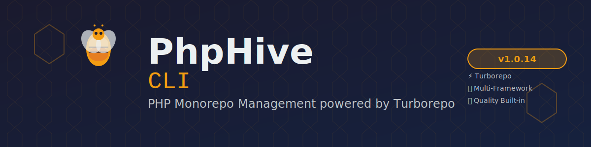

<div align="center">



# Mono CLI

**A powerful, production-ready CLI tool for managing PHP monorepos with Turborepo integration**

[](https://www.php.net/)
[](LICENSE)
[](https://github.com/mono-php/cli/actions)
[](https://packagist.org/packages/mono-php/cli)
[](https://packagist.org/packages/mono-php/cli)

[Features](#-features) •
[Installation](#-installation) •
[Quick Start](#-quick-start) •
[Commands](#-commands) •
[Documentation](#-documentation) •
[Contributing](#-contributing)

</div>

---

## 📋 Table of Contents

- [Features](#-features)
- [Requirements](#-requirements)
- [Installation](#-installation)
- [Quick Start](#-quick-start)
- [Commands](#-commands)
  - [Workspace Management](#workspace-management)
  - [Development](#development)
  - [Testing & Quality](#testing--quality)
  - [Dependencies](#dependencies)
  - [Deployment](#deployment)
  - [Maintenance](#maintenance)
  - [Turborepo](#turborepo)
- [Configuration](#-configuration)
- [Project Structure](#-project-structure)
- [API Reference](#-api-reference)
- [Development](#-development)
- [Testing](#-testing)
- [Contributing](#-contributing)
- [Security](#-security)
- [License](#-license)
- [Credits](#-credits)

---

## ✨ Features

### 🚀 Core Features
- **Turborepo Integration** - Parallel task execution with intelligent caching
- **Workspace Management** - Manage multiple packages and apps effortlessly
- **Interactive CLI** - Beautiful prompts powered by Laravel Prompts
- **Composer Integration** - Simplified dependency management
- **Quality Tools** - Built-in testing, linting, and static analysis

### 🧪 Quality & Testing
- **PHPUnit** - Comprehensive test suite with 58+ tests
- **PHPStan** - Static analysis at level 8
- **Laravel Pint** - Automatic code formatting
- **Rector** - Automated refactoring for PHP 8.3+
- **Infection** - Mutation testing for test quality

### 🎨 Developer Experience
- **Auto-discovery** - Commands are automatically discovered
- **Dependency Injection** - Built-in DI container
- **Common Options** - Shared options across all commands
- **Beautiful Output** - Styled console output with colors
- **Error Handling** - Comprehensive error messages

### 📦 Scaffolding
- **Create Packages** - Generate new packages with proper structure
- **Create Apps** - Scaffold new applications
- **Workspace Init** - Initialize new monorepo workspaces

---

## 📦 Requirements

- **PHP**: 8.3 or higher
- **Composer**: 2.0 or higher
- **Extensions**: mbstring, json, tokenizer, xml, ctype, iconv

---

## 🚀 Installation

### Global Installation (Recommended)

```bash
composer global require mono-php/cli
```

### Local Installation

```bash
composer require --dev mono-php/cli
```

### Verify Installation

```bash
mono version
```

---

## ⚡ Quick Start

### 1. Initialize a New Workspace

```bash
mono make:workspace
```

Follow the interactive prompts to create your monorepo structure.

### 2. Create a Package

```bash
mono create:package my-package
```

### 3. Install Dependencies

```bash
mono install
```

### 4. Run Tests

```bash
mono test
```

### 5. Check Code Quality

```bash
mono lint
mono typecheck
```

---

## 📚 Commands

Mono CLI provides 25 commands organized into 9 categories:

### Workspace Management

#### `mono make:workspace`
Initialize a new monorepo workspace with interactive setup.

```bash
# Interactive mode
mono make:workspace

# Non-interactive mode
mono make:workspace --name=my-monorepo --type=monorepo --no-interaction

# Skip Git initialization
mono make:workspace --no-git
```

**Options:**
- `--name=NAME` - Workspace name
- `--type=TYPE` - Workspace type (monorepo, package, app)
- `--no-git` - Skip Git initialization
- `--no-interaction, -n` - Run without prompts

**Aliases:** `init`, `new`

---

#### `mono list-workspaces`
List all workspaces in the monorepo.

```bash
mono list-workspaces

# Filter by type
mono list-workspaces --type=package
```

**Options:**
- `--type=TYPE` - Filter by workspace type

**Aliases:** `list`, `ls`

---

#### `mono info`
Show detailed information about a workspace.

```bash
mono info my-package

# Show dependencies
mono info my-package --dependencies
```

**Arguments:**
- `workspace` - Workspace name

**Options:**
- `--dependencies` - Show dependency tree

---

### Development

#### `mono dev`
Start development server with hot reload.

```bash
# Start dev server
mono dev

# Specify workspace
mono dev --workspace=my-app

# Custom port
mono dev --port=8080
```

**Options:**
- `--port=PORT` - Server port (default: 8000)
- `--host=HOST` - Server host (default: localhost)

**Aliases:** `serve`

---

#### `mono build`
Build for production.

```bash
# Build all workspaces
mono build

# Build specific workspace
mono build --workspace=my-app

# Production build
mono build --production
```

**Options:**
- `--production` - Production build mode
- `--minify` - Minify output

---

### Testing & Quality

#### `mono test`
Run PHPUnit tests.

```bash
# Run all tests
mono test

# Run specific test suite
mono test --testsuite=Unit

# Run with coverage
mono test --coverage

# Run specific workspace tests
mono test --workspace=my-package

# Run specific test file
mono test --filter=MyTest

# Parallel execution
mono test --parallel
```

**Options:**
- `--testsuite=SUITE` - Test suite to run (Unit, Feature)
- `--coverage` - Generate coverage report
- `--filter=PATTERN` - Filter tests by pattern
- `--parallel` - Run tests in parallel

**Aliases:** `phpunit`

---

#### `mono lint`
Check code style with Laravel Pint.

```bash
# Check code style
mono lint

# Check specific workspace
mono lint --workspace=my-package

# Check specific path
mono lint src/Commands
```

**Options:**
- `--dirty` - Only check uncommitted files

**Aliases:** `pint`

---

#### `mono format`
Fix code style automatically.

```bash
# Fix all files
mono format

# Fix specific workspace
mono format --workspace=my-package

# Fix specific path
mono format src/Commands

# Dry run (preview changes)
mono format --dry-run
```

**Options:**
- `--dry-run` - Preview changes without applying
- `--dirty` - Only fix uncommitted files

**Aliases:** `fix`, `pint:fix`

---

#### `mono typecheck`
Run PHPStan static analysis.

```bash
# Run static analysis
mono typecheck

# Specific workspace
mono typecheck --workspace=my-package

# Generate baseline
mono typecheck --generate-baseline

# Custom level
mono typecheck --level=8
```

**Options:**
- `--level=LEVEL` - Analysis level (0-9)
- `--generate-baseline` - Generate baseline file

**Aliases:** `phpstan`, `analyse`, `analyze`

---

#### `mono refactor`
Run Rector refactoring.

```bash
# Preview refactoring
mono refactor

# Apply refactoring
mono refactor --fix

# Specific workspace
mono refactor --workspace=my-package
```

**Options:**
- `--fix` - Apply refactoring changes
- `--dry-run` - Preview changes only (default)

**Aliases:** `rector`

---

#### `mono mutate`
Run Infection mutation testing.

```bash
# Run mutation tests
mono mutate

# Specific workspace
mono mutate --workspace=my-package

# Custom configuration
mono mutate --configuration=infection.json5
```

**Options:**
- `--min-msi=SCORE` - Minimum MSI score
- `--min-covered-msi=SCORE` - Minimum covered MSI score

**Aliases:** `infection`

---

### Dependencies

#### `mono install`
Install all dependencies across workspaces.

```bash
# Install all dependencies
mono install

# Install with specific flags
mono install --no-dev

# Update lock file
mono install --update-lock
```

**Options:**
- `--no-dev` - Skip dev dependencies
- `--update-lock` - Update lock file

**Aliases:** `i`

---

#### `mono require`
Add a package dependency.

```bash
# Add production dependency
mono require vendor/package

# Add dev dependency
mono require --dev phpunit/phpunit

# Add to specific workspace
mono require vendor/package --workspace=my-package

# Add with version constraint
mono require "vendor/package:^2.0"
```

**Options:**
- `--dev, -D` - Add as dev dependency
- `--update-with-dependencies` - Update dependencies

**Aliases:** `add`

---

#### `mono update`
Update dependencies.

```bash
# Update all dependencies
mono update

# Update specific package
mono update vendor/package

# Update in specific workspace
mono update --workspace=my-package

# Update with dependencies
mono update --with-dependencies
```

**Options:**
- `--with-dependencies` - Update with dependencies
- `--prefer-stable` - Prefer stable versions

**Aliases:** `upgrade`

---

#### `mono composer`
Run arbitrary Composer commands.

```bash
# Run any Composer command
mono composer show

# With arguments
mono composer require vendor/package --dev

# In specific workspace
mono composer show --workspace=my-package
```

**Arguments:**
- `command` - Composer command to run
- `args` - Additional arguments (optional)

---

### Deployment

#### `mono deploy`
Run deployment pipeline.

```bash
# Deploy all workspaces
mono deploy

# Deploy specific workspace
mono deploy --workspace=my-app

# Deploy to specific environment
mono deploy --env=production

# Dry run
mono deploy --dry-run
```

**Options:**
- `--env=ENV` - Target environment
- `--dry-run` - Preview deployment steps

---

#### `mono publish`
Publish packages to registry.

```bash
# Publish all packages
mono publish

# Publish specific package
mono publish --workspace=my-package

# Publish with tag
mono publish --tag=latest
```

**Options:**
- `--tag=TAG` - Version tag
- `--dry-run` - Preview publish

---

### Maintenance

#### `mono clean`
Clean caches and temporary files.

```bash
# Clean all caches
mono clean

# Clean specific cache
mono clean --cache=phpstan

# Clean specific workspace
mono clean --workspace=my-package
```

**Options:**
- `--cache=TYPE` - Specific cache to clean

**Aliases:** `clear`

---

#### `mono cleanup`
Deep clean (destructive operation).

```bash
# Deep clean with confirmation
mono cleanup

# Force cleanup without confirmation
mono cleanup --force

# Clean specific workspace
mono cleanup --workspace=my-package
```

**Options:**
- `--force, -f` - Skip confirmation

**Warning:** This removes vendor directories and lock files.

---

### Turborepo

#### `mono turbo`
Direct access to Turborepo commands.

```bash
# Run turbo command
mono turbo run build

# With filters
mono turbo run test --filter=my-package

# With cache options
mono turbo run build --no-cache
```

**Arguments:**
- `command` - Turbo command to run
- `args` - Additional arguments (optional)

---

#### `mono run`
Run arbitrary Turbo tasks.

```bash
# Run task across all workspaces
mono run build

# Run in specific workspace
mono run test --workspace=my-package

# Run with filters
mono run build --filter=my-*

# Parallel execution
mono run test --parallel

# Skip cache
mono run build --no-cache
```

**Arguments:**
- `task` - Task name to run

**Options:**
- `--filter=PATTERN` - Filter workspaces
- `--parallel` - Run in parallel

---

### Utility

#### `mono doctor`
System health check and diagnostics.

```bash
# Run health check
mono doctor

# Verbose output
mono doctor --verbose

# Check specific component
mono doctor --check=php
```

**Options:**
- `--check=COMPONENT` - Check specific component

**Checks:**
- PHP version and extensions
- Composer installation
- Turborepo availability
- Workspace configuration
- File permissions

---

#### `mono version`
Show version information.

```bash
# Show version
mono version

# Show all versions
mono version --all
```

**Options:**
- `--all` - Show all component versions

**Aliases:** `--version`, `-V`

---

### Common Options

All commands support these common options:

- `--workspace, -w=NAME` - Target specific workspace
- `--force, -f` - Force operation (skip cache)
- `--no-cache` - Disable Turbo cache
- `--no-interaction, -n` - Run in non-interactive mode
- `--help, -h` - Display help
- `--quiet, -q` - Suppress output
- `--verbose, -v` - Verbose output

---

## ⚙️ Configuration

### composer.json

```json
{
  "name": "my-org/monorepo",
  "type": "project",
  "require": {
    "php": "^8.3",
    "mono-php/cli": "^1.0"
  },
  "scripts": {
    "test": "mono test",
    "lint": "mono lint",
    "format": "mono format",
    "typecheck": "mono typecheck"
  }
}
```

### turbo.json

```json
{
  "$schema": "https://turbo.build/schema.json",
  "pipeline": {
    "build": {
      "dependsOn": ["^build"],
      "outputs": ["dist/**", "build/**"]
    },
    "test": {
      "dependsOn": ["build"],
      "outputs": ["coverage/**"]
    },
    "lint": {
      "outputs": []
    }
  }
}
```

### pnpm-workspace.yaml

```yaml
packages:
  - 'packages/*'
  - 'apps/*'
```

---

## 📁 Project Structure

```
monorepo/
├── apps/                    # Applications
│   └── demo-app/
│       ├── public/
│       ├── src/
│       └── composer.json
├── packages/                # Shared packages
│   └── calculator/
│       ├── src/
│       ├── tests/
│       └── composer.json
├── cli/                     # Mono CLI tool
│   ├── bin/
│   │   └── mono            # CLI entry point
│   ├── src/
│   │   ├── Application.php
│   │   ├── Commands/       # All commands
│   │   ├── Concerns/       # Reusable traits
│   │   └── Support/        # Helper classes
│   ├── tests/              # Test suite
│   ├── composer.json
│   ├── phpunit.xml
│   ├── phpstan.neon
│   ├── rector.php
│   └── pint.json
├── composer.json            # Root composer file
├── turbo.json              # Turborepo config
└── pnpm-workspace.yaml     # Workspace config
```

---

## 🔧 API Reference

### Application Class

```php
use MonoPhp\Cli\Application;

$app = new Application();
$app->run();
```

### BaseCommand

All commands extend `BaseCommand` which provides:

```php
namespace MonoPhp\Cli\Commands;

use Symfony\Component\Console\Command\Command;

abstract class BaseCommand extends Command
{
    // Common options are automatically added
    protected function configure(): void
    {
        parent::configure();
        // Add command-specific configuration
    }
    
    // Access to helper methods
    protected function getWorkspaceRoot(): string;
    protected function getWorkspaces(): array;
    protected function runComposer(array $args): int;
    protected function runTurbo(array $args): int;
}
```

### Support Classes

#### Container

```php
use MonoPhp\Cli\Support\Container;

$container = new Container();
$container->bind('key', fn() => new Service());
$service = $container->make('key');
```

#### Filesystem

```php
use MonoPhp\Cli\Support\Filesystem;

$fs = new Filesystem();
$fs->ensureDirectoryExists('/path/to/dir');
$files = $fs->files('/path/to/dir');
```

#### Arr (Array Helper)

```php
use MonoPhp\Cli\Support\Arr;

$value = Arr::get($array, 'key.nested', 'default');
$filtered = Arr::where($array, fn($v) => $v > 10);
```

---

## 🛠️ Development

### Setup Development Environment

```bash
# Clone repository
git clone https://github.com/mono-php/cli.git
cd cli

# Install dependencies
composer install

# Run tests
composer test
```

### Running Quality Checks

```bash
# Run all checks
composer check

# Individual checks
composer test          # PHPUnit tests
composer lint          # Code style check
composer typecheck     # Static analysis
composer refactor:dry  # Refactoring check

# Fix issues
composer fix           # Fix code style and apply refactoring
composer format        # Fix code style only
composer refactor      # Apply refactoring only
```

### Project Scripts

```json
{
  "scripts": {
    "test": "PHPUnit tests",
    "test:coverage": "Tests with coverage",
    "lint": "Check code style",
    "format": "Fix code style",
    "typecheck": "Static analysis",
    "refactor": "Apply refactoring",
    "refactor:dry": "Preview refactoring",
    "check": "Run all checks",
    "fix": "Fix all issues"
  }
}
```

---

## 🧪 Testing

### Running Tests

```bash
# Run all tests
composer test

# Run specific test suite
vendor/bin/phpunit --testsuite=Unit

# Run with coverage
composer test:coverage

# Run specific test
vendor/bin/phpunit tests/Unit/Support/ContainerTest.php
```

### Test Structure

```
tests/
├── Unit/                   # Unit tests
│   ├── Commands/
│   └── Support/
├── Feature/                # Feature tests
├── Fixtures/               # Test fixtures
└── TestCase.php           # Base test case
```

### Writing Tests

```php
namespace MonoPhp\Cli\Tests\Unit;

use MonoPhp\Cli\Tests\TestCase;

class MyTest extends TestCase
{
    public function test_example(): void
    {
        $this->assertTrue(true);
    }
}
```

---

## 🤝 Contributing

We welcome contributions! Please see [CONTRIBUTING.md](CONTRIBUTING.md) for details.

### Quick Contribution Guide

1. Fork the repository
2. Create a feature branch (`git checkout -b feature/amazing-feature`)
3. Make your changes
4. Run quality checks (`composer check`)
5. Commit your changes (`git commit -m 'feat: add amazing feature'`)
6. Push to the branch (`git push origin feature/amazing-feature`)
7. Open a Pull Request

### Code Standards

- Follow PSR-12 coding standards
- Add comprehensive docblocks
- Write tests for new features
- Ensure all quality checks pass
- Update documentation

---

## 🔒 Security

If you discover a security vulnerability, please review our [Security Policy](SECURITY.md) and report it privately to **security@mono-php.dev**.

Do not open public issues for security concerns.

---

## 📄 License

Mono CLI is open-sourced software licensed under the [MIT license](LICENSE).

---

## 🙏 Credits

Built with:

- [Symfony Console](https://symfony.com/doc/current/components/console.html) - Command-line interface framework
- [Laravel Prompts](https://laravel.com/docs/prompts) - Beautiful interactive prompts
- [Laravel Pint](https://laravel.com/docs/pint) - Code style fixer
- [PHPStan](https://phpstan.org/) - Static analysis tool
- [Rector](https://getrector.com/) - Automated refactoring
- [PHPUnit](https://phpunit.de/) - Testing framework
- [Infection](https://infection.github.io/) - Mutation testing
- [Turborepo](https://turbo.build/) - High-performance build system

---

## 📞 Support

- **Documentation**: [GitHub README](https://github.com/mono-php/cli#readme)
- **Issues**: [GitHub Issues](https://github.com/mono-php/cli/issues)
- **Discussions**: [GitHub Discussions](https://github.com/mono-php/cli/discussions)
- **Changelog**: [CHANGELOG.md](CHANGELOG.md)

---

<div align="center">

**[⬆ back to top](#mono-cli)**

Made with ❤️ by the Mono PHP team

</div>
